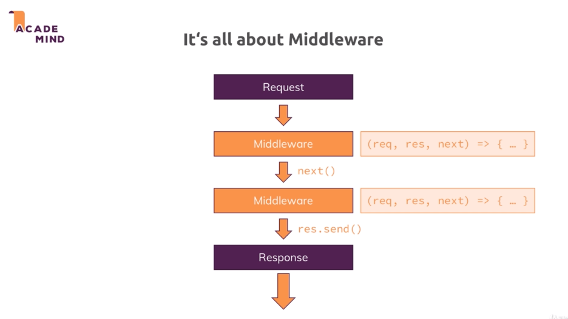
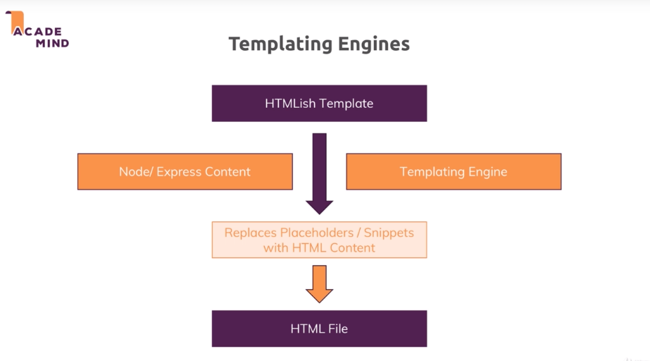
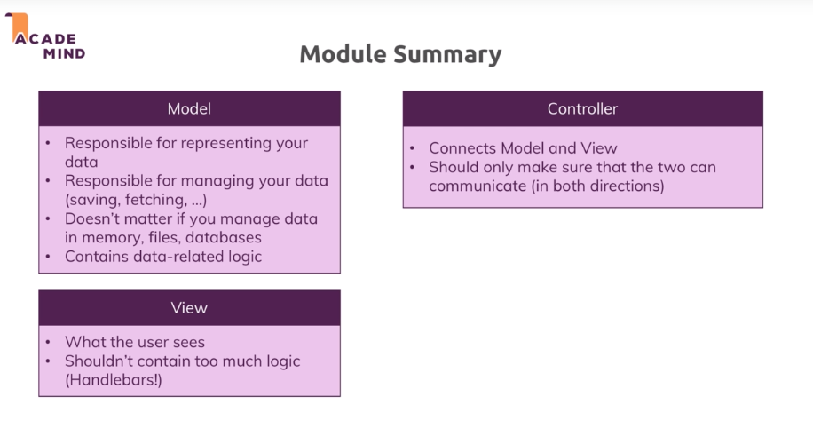
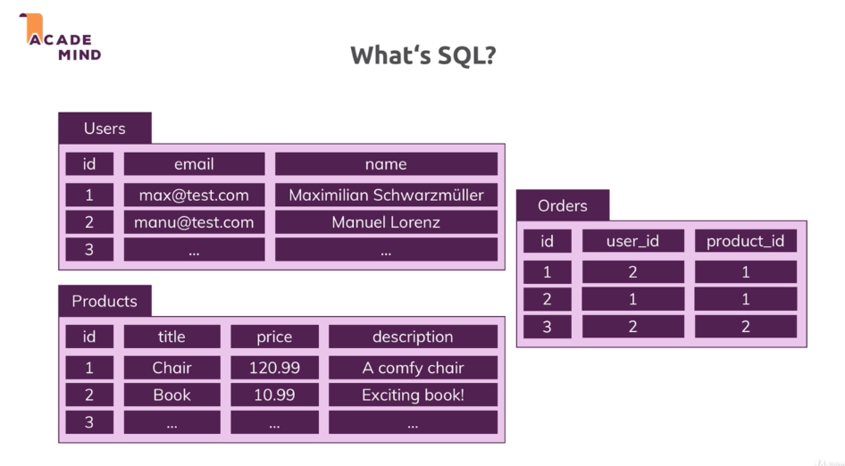
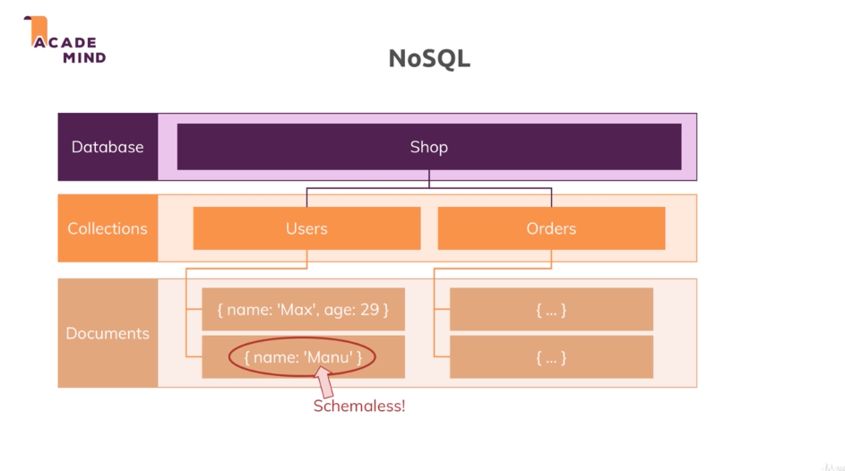
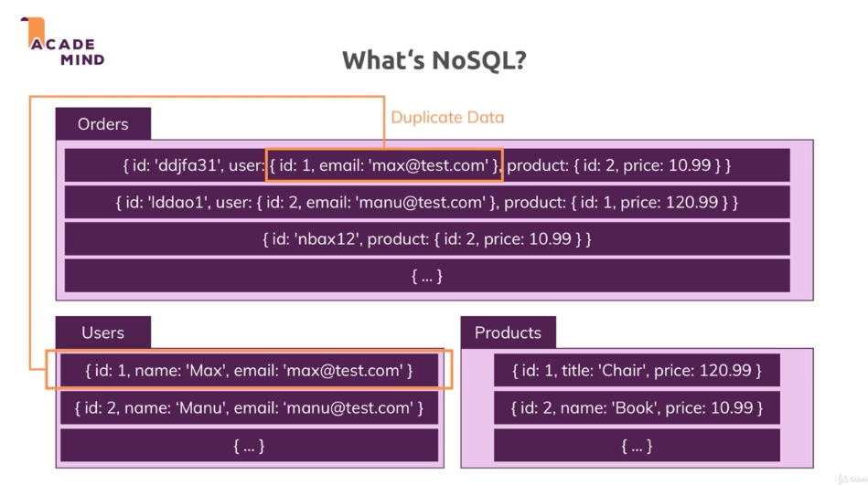
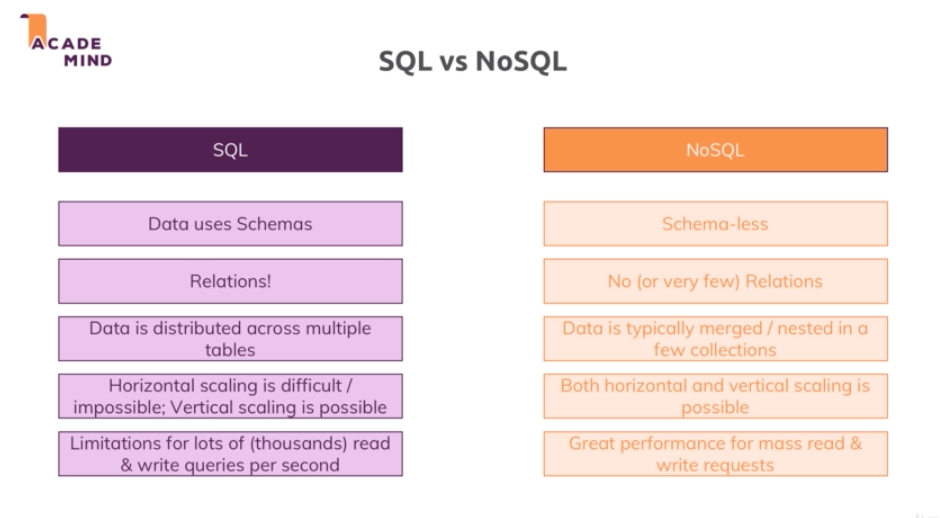

# Nodejs

## Basics

### The node lifecycle & event loop


```js
const http = require('http');

const server = http.createServer((req, res) =>{
    console.log(req)
    res.setHeader('Content-Type', 'text/html');
    res.write('<html>');
    res.write('<head><title>Hello World</title></head>');
    res.write('<body><h1>Hello World</h1></body>');
    res.write('</html>');
});
server.listen(5000);
```

More about http headers = https://developer.mozilla.org/en-US/docs/Web/HTTP/Headers


### Nodejs behind the scene


## Debugging

## Express.js
 
### Middleware


```js
npm install express --save
```
nb: --save because we want it in production
```js
const express = require('express');

const app = express();

app.use((req, res, next)=>{
    console.log('In the middleware');
    res.send('<h1>Hello from Express</h1>');
    next();
})

app.listen();
```

next() is used to say that the server request has to go to the next middleware, otherwise, the next middleware won't be called


### Handling routes

```js
// will be called if the url is /about. Be aware to not use next so the '/' isn't called
app.use('/about', (req, res, next) =>{

});

// will be called if the url begins with /
app.use('/', (req, res, next) =>{

});
```

### Parsing incoming request

Use the body-parser library
```js
npm install --save body-parser
```
To parse incoming request, we need to use the body-parser middleware
```js
 const express = require('express');
 const bodyParser = require('body-parser');

// body parser middleware
 app.use(bodyParser.urlencoded({extended: false});


 app.use('/add-product', (req, res, next) =>{
     res.send('<form><input type="text" name="product" /><button>Add product</button></form>');
 });

 app.use('/product', (req, res, next) =>{
     // req.body comes from add-product
     console.log(req.body);
     res.redirect('/');
 })

 app.use('/', (req, res, next) =>{
     res.send('<h1>Homepage</h1>')
 })
 ```

### Limiting middleware execution to POST, GET, ...
In the next exemple, if you try to access the page without the post, you will end up to the next middleware that meets the route requirement
```js
app.post('/product', (req, res, next) =>{
     // req.body comes from add-product
     console.log(req.body);
     res.redirect('/');
})
 ```


### Express router
Be aware that if we use .get, the route is limited to the exact path
***shop.js***
```js
const express = require('express');
const router = express.Router();

router.get('/', (req, res, next) =>{
    res.send('<h1>Homepage</h1>')
})

module.exports = router; 
```

***app.js***
```js
const express = require('express');
const bodyParser = require('body-parser');

const app = express();

const adminRoutes = require('./routes/admin');
const shopRoutes = require('./routes/shop');


// body parser middleware
app.use(bodyParser.urlencoded({extended: false}));

// Will filter the path to /admin/...
app.use('/admin', adminRoutes);
app.use(shopRoutes);

// Add a 404 page catching all the routes that don't match the definited ones
app.use((req, res, next) =>{
    res.status(404).send('<h1>Page not found</h1>');
    
})

app.listen(5000);
```
### Serving html files

```js
const path = require('path');
router.get('/', (req, res, next) =>{
    res.sendFile(path.join(__dirname, '../', 'views', 'shop.html'))
})
```

### Using a helper function for nav
***utils/path.js***
```js
const path = require('path');
// process.mainModule.filename means the app.js (mainModule means the module that started the app)
module.exports = path.dirname(process.mainModule.filename);
```
Then import it into the js files

```js
const path = require('path');

const express = require('express');
const router = express.Router();
const rootDir = require('../utils/path');


router.get('/', (req, res, next) =>{
    res.sendFile(path.join(rootDir, 'views', 'shop.html'))
})

module.exports = router;  
```

### Serving static files

```html
<link rel="stylesheet" href="/css/main.css">
```
```js
app.use(express.static(path.join(__dirname, 'public')));
```

#### Module summary


## Dynamic content & Templating engine

```js
const path = require('path');
const express = require('express');

const router = express.Router();

const rootDir = require('../utils/path');

const products = [];


router.get('/add-product', (req, res, next) =>{
    res.sendFile(path.join(rootDir, 'views', 'add-product.html'));
});

router.post('/add-product', (req, res, next) =>{
    // req.body comes from add-product
    products.push({ title: req.body.title });
    console.log(req.body);

    res.redirect('/');
})

exports.routes = router; //Don't forget to update the import inside the app.js to be app.use('/admin', adminData.routes);
exports.products = products; 
```



Exemple of templating engines
- EJS
- Pug
- Handlebars
***app.js***
```js
app.set('view engine', 'pug');
app.set('views', 'views');
```

and into the js files 
```js
router.get('/', (req, res, next) =>{
    const products = adminData.products;
    //res.sendFile(path.join(rootDir, 'views', 'shop.html'))
    res.render('shop', {prods: products, docTitle: 'Shop'}); 
})
```


## Module View Controller


### Controllers
***controllers/product.js***
```js
const products = [];

exports.getAddProduct = (req, res, next) => {
    res.render('add-product', {
        pageTitle: 'Add Product',
        path: '/admin/add-product',
        formsCSS: true,
        productCSS: true,
        activeAddProduct: true
    });
};


exports.postAddProduct = (req, res, next) => {
    products.push({ title: req.body.title });
    res.redirect('/');
};
```

***routes/admin.js***
```js
const express = require('express');
const router = express.Router();


const productsController = require('../controllers/product');

// /admin/add-product => GET
router.get('/add-product', productsController.getAddProduct);

// /admin/add-product => POST
router.post('/add-product', productsController.postAddProduct);

module.exports = router;

```

### Models

***models/product.js***
```js
const products = [];
module.exports = class Product {
    constructor(t){
        this.title = t;
    }

    save(){
        products.push(this)
    }
    // static so we can access the method without creating a new Product instance
    static fetchAll(){
        return products;
    }
}
```
***controllers/product.js***
```js
const Product = require('../models/product');

exports.getAddProduct = (req, res, next) => {
    res.render('add-product', {
        pageTitle: 'Add Product',
        path: '/admin/add-product',
        formsCSS: true,
        productCSS: true,
        activeAddProduct: true
    });
};


exports.postAddProduct = (req, res, next) => {
    // create an instance of the product
    const product = new Product(req.body.title);
    product.save();
    res.redirect('/');
};

exports.getProducts = (req, res, next) => {
    // call the static method
    const products = Product.fetchAll();
    res.render('shop', {
      prods: products,
      pageTitle: 'Shop',
      path: '/',
      hasProducts: products.length > 0,
      activeShop: true,
      productCSS: true
    });
};
```

### Storing & fetching data in files via the model

***product.js***
```js
const fs = require('fs');
const path = require('path');

module.exports = class Product {
    constructor(t){
        this.title = t;
    }

    save(){
        const p = path.join(
            path.dirname(process.mainModule.filename), 
            'data', 
            'products.json'
        );
        //if no products let products = [], else push this (which is the instance of the object), add it to the array and write it into the file
        fs.readFile(p, (err, fileContent) => {
            let products = [];
            if(!err){
                products = JSON.parse(fileContent);
            }
            products.push(this);
            fs.writeFile(p, JSON.stringify(products), (err) =>{
                console.log(err);
            });
        });
    };

    // Using a callback function to return the object when it is loaded
    static fetchAll(callback){
        const p = path.join(
            path.dirname(process.mainModule.filename), 
            'data', 
            'products.json'
        );
        fs.readFile(p, (err, fileContent) => {
            if(err){
                callback([])
            } 
            callback(JSON.parse(fileContent));
        })
    }
}
```

***controller/product.js***
```js
/// Using the callback function to render only when fetchAll is done
exports.getProducts = (req, res, next) => {
    const products = Product.fetchAll((products) =>{
        res.render('shop', {
            prods: products,
            pageTitle: 'Shop',
            path: '/',
            hasProducts: products.length > 0,
            activeShop: true,
            productCSS: true
          });
    });  
};

```

Refactoring of the product model 
```js
const fs = require('fs');
const path = require('path');

const getProductsFromFile = (cb) =>{
    const p = path.join(
        path.dirname(process.mainModule.filename), 
        'data', 
        'products.json'
    );
    fs.readFile(p, (err, fileContent) => {
        if(err){
           return cb([])
        } 
        cb(JSON.parse(fileContent));
    })
}

module.exports = class Product {
    constructor(t){
        this.title = t;
    }
    save(){
        getProductsFromFile(products =>{
            products.push(this);
            fs.writeFile(p, JSON.stringify(products), (err) =>{
                console.log(err);
            });
        })
    };

    static fetchAll(cb){
        getProductsFromFile(cb);
    }
}
```

### Summary



## Dynamic Routes & advanced models

### See the details page

We need to generate an ID during the save of our product object into the product model.
To pass it to the view 
```html
<a href="/product/<%= product.id %>"></a>
```

We also need to update the route to handle those views
```js
router.get('/products/:productId');
```

Be carefull, if we got another route (ie: delete), we need to pass the most specific route first, otherwise the app would never reach the specific path

```js
router.get('/products/delete');
router.get('/products/:productId', shopController.getProduct);
```

And into the controller

```js
exports.getProducts = (req, res, next) =>{
  const prodId = req.params.productId;
  Product.findById(prodId, product =>{
      console.log(product);
  })
  res.redirect('/');
}
```

To render to the view
```js

exports.getProducts = (req, res, next) =>{
  const prodId = req.params.productId;
  Product.findById(prodId, product =>{
      res.render('shop/product-detail', {product: product});
  })
}
```

### Adding to the cart

```html
<form action="/cart" method='post'>
    <button class="btn">Add to the cart</button>
    <input type="hidden" name="productID" value="<%= product.id %>">
</form>
```

```js
exports.postCart = (req, res, next) =>{
    // req is passed through the form
    const prodId = req.body.productId;
    Product.findById(prodId, (product) =>{
      Cart.addProduct(prodId, product.price)
    })
}
```

Create a new cart model
```js
const fs = require('fs');
const path = require('path');

const p = path.join(
  path.dirname(process.mainModule.filename),
  'data',  
  'cart.json'
);

module.exports = class Cart{
    static addProduct(id, productPrice){
        // fetch the previous cart
        fs.readFile(p, (err, fileContent) =>{
            // if we have an error, create a cart
            let cart = {products: [], totalPrice: 0};

            // else the cart = the previous cart
            if(!err){
                cart = JSON.parse(fileContent);
            }

            // Analyse the cart
            const existingProductIndex = cart.products.findIndex(prod => prod.id === id);
            const existingProduct = cart.products[existingProductIndex];
            let updatedProduct;
            if(existingProduct){
                // if existing, update the quantity
                updatedProduct = { ...existingProduct};
                updatedProduct.qty = updatedProduct.qty + 1;
                // update the array of products
                cart.products = [...cart.products]
                // set the already existing product to be equal to the updatedProduct
                cart.products[existingProductIndex] = updatedProduct;
            }else{
                // Add new product
                updatedProduct = {id: id, qty: 1};
                // update the array of products with the 
                cart.products = [...cart.products, updatedProduct]
            }
            // the second + converts productPrice to a number
            cart.totalPrice = cart.totalPrice + +productPrice;
            fs.writeFile(p, JSON.stringify(cart), (err) =>{
                console.log(err);
            })
            
        })
        
    }
}
```


### Edit a product

### Query Pramas

### Prepopulate the form
```js
exports.getEditProduct = (req, res, next) => {
  const editMode = req.query.edit;

  Product.findById(prodId(prodId, product =>{
    res.render('admin/edit-product/', {
      pageTitle: 'Edit Product',
      path: '/admin/add-product',
      editing: editMode,
      product: product
    });
  }))
};
```

Inside the html
```html
<!-- IF edit mode, prepopulate the value -->
<input value="<% if (editing) { %><%= product.title %><%= } %>"/>
```


## SQL introduction

### Sql or NoSql ?

***Sql***
- SQL databases let you make relations between tables
- Strong data Schema




***NoSql***
- Schemaless
- No relation between table -> duplicate data but you can access the data in one command without making a call to another table first (you can actually use a trick to link documents but it's slower)




#### Horizontal vs vertical scaling

- Horizontal means that you add different instances of the same db
- Vertical means that you upgrade the cpu/hardware/capacity of server (limited)

-> Horizontal scaling is hard in SQL
-> Horizontal scaling is easier in NoSQL

SQL is still a better choice if we need strong relation between table & strong schemas

